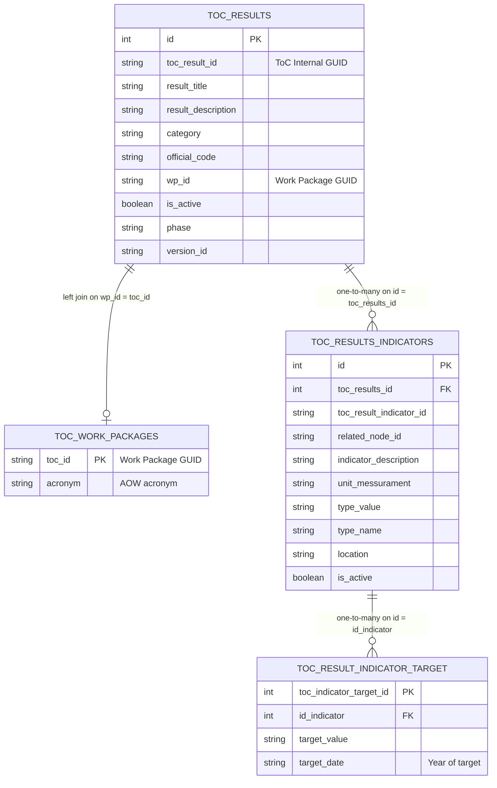

# ToC Results API Endpoint Documentation

This document describes the technical specifications, data structure, and usage of the ToC Results API endpoint implemented in `CLARISA/toc-integration`.

---

## 1. Overview

The endpoint is designed to expose the Theory of Change (ToC) results, associated work packages (AOWs), indicators, and targets directly from the integration database (`Integration_information` / `DB_TOC`). It acts as a catalog service for external applications, omitting reporting-specific mapping fields from `onecgiar-pr-server` (e.g., local result linkages, narrative texts, status indicators).

---

## 2. API Reference

### Production Base URL
```
https://lambda-toc.clarisa.cgiar.org/api
```

### Get ToC Results by Category and Initiative

Returns a list of active ToC results matching the specified category and initiative official code, ordered by their Work Package (AOW) acronym and result title.

- **Path**: `/toc-integration/toc/results/category/:category/initiative/:official_code`
- **Production URL**: `https://lambda-toc.clarisa.cgiar.org/api/toc-integration/toc/results/category/:category/initiative/:official_code`
- **Method**: `GET`
- **Headers**:
  - `Content-Type: application/json`

#### Route Parameters

| Parameter | Type | Required | Description |
| :--- | :--- | :--- | :--- |
| `category` | `string` | Yes | The category of the ToC level. Allowed values: `OUTPUT`, `OUTCOME`, `EOI`. (Case-insensitive) |
| `official_code` | `string` | Yes | The official code of the initiative (e.g., `SP01`, `SP02`, `SGP-02`). |

#### Query Parameters

| Parameter | Type | Required | Description |
| :--- | :--- | :--- | :--- |
| `year` | `number` | No | Reporting year (e.g. `2025`, `2026`). **Default: `2025`**. Resolves the ToC phase UUID automatically. |
| `phase` | `string` | No | ToC Phase UUID (legacy). If both `year` and `phase` are sent, they must refer to the same reporting year. |

**Examples:**

```
GET .../toc/results/category/OUTPUT/initiative/SP09
GET .../toc/results/category/OUTPUT/initiative/SP09?year=2026
GET .../toc/results/category/EOI/initiative/SP09?year=2026
```

**Response envelope:**

```json
{
  "meta": {
    "year": 2026,
    "phase": "7baf200a-c958-4ded-9894-6557a94cae18"
  },
  "response": [ "... results ..." ]
}
```

---

## 3. Database Relations

The endpoint performs cross-table queries directly on the following tables in the integration database schema:


```mermaid
erDiagram
    TOC_RESULTS {
        int id PK
        string toc_result_id "ToC Internal GUID"
        string result_title
        string result_description
        string category
        string official_code
        string wp_id "Work Package GUID"
        boolean is_active
        string phase
        string version_id
    }
    TOC_WORK_PACKAGES {
        string toc_id PK "Work Package GUID"
        string acronym "AOW acronym"
    }
    TOC_RESULTS_INDICATORS {
        int id PK
        int toc_results_id FK
        string toc_result_indicator_id
        string related_node_id
        string indicator_description
        string unit_messurament
        string type_value
        string type_name
        string location
        boolean is_active
    }
    TOC_RESULT_INDICATOR_TARGET {
        int toc_indicator_target_id PK
        int id_indicator FK
        string target_value
        string target_date "Year of target"
    }

    TOC_RESULTS ||--o| TOC_WORK_PACKAGES : "left join on wp_id = toc_id"
    TOC_RESULTS ||--o{ TOC_RESULTS_INDICATORS : "one-to-many on id = toc_results_id"
    TOC_RESULTS_INDICATORS ||--o{ TOC_RESULT_INDICATOR_TARGET : "one-to-many on id = id_indicator"
```

---

## 4. Response Payload Schema

The response returns a JSON envelope containing the response data:

```json
{
  "response": [
    {
      "toc_result_id": 5715,
      "toc_internal_id": "1dccf03d-0785-4bb4-85a8-a27a29c33e07",
      "title": "8.1.2 FAIR Data Tools and Infrastructure for Modeling",
      "description": "Tools, approaches, and infrastructure for the standardization, FAIRification...",
      "toc_type_id": null,
      "toc_level_id": null,
      "official_code": "SP02",
      "work_package_id": "050962df-6f1a-484a-8d0c-83950c17f4d9",
      "wp_short_name": "AOW08",
      "phase": "99134294-d7a1-4966-a63e-227c9e29b9fb",
      "version_id": "84d1a2c6-f2c8-49fd-81b7-5634bd03b9ce",
      "indicators": [
        {
          "indicator_id": 6768,
          "toc_result_indicator_id": "a734e469-8226-4787-9aab-c99bd58b460e",
          "related_node_id": "b4a4799d-d81d-4110-bab6-b81089031986",
          "indicator_description": "Number of tools and approaches to support the development of farm advisories",
          "unit_messurament": "Number",
          "type_value": "Number of innovations (innovation development)",
          "type_name": "Number of innovations (innovation development)",
          "location": "global",
          "targets": [
            {
              "target_value": "5",
              "target_date": "2025"
            },
            {
              "target_value": "2",
              "target_date": "2026"
            }
          ]
        }
      ]
    }
  ]
}
```

### JSON Fields Description

#### Result Object
- **`toc_result_id`** *(number)*: Internal database primary key ID of the ToC result.
- **`toc_internal_id`** *(string)*: GUID representing the original ToC internal identifier.
- **`title`** *(string)*: Title of the ToC result.
- **`description`** *(string)*: Detailed statement of the result.
- **`official_code`** *(string)*: Initiative code (e.g. `SP02`).
- **`work_package_id`** *(string)*: GUID identifying the associated work package.
- **`wp_short_name`** *(string)*: Short acronym name of the work package / AOW (e.g. `AOW08`).
- **`phase`** *(string)*: GUID identifying the ToC phase.
- **`version_id`** *(string)*: GUID of the synchronized version.
- **`indicators`** *(array)*: List of indicators associated with this ToC result.

#### Indicator Object
- **`indicator_id`** *(number)*: Internal database primary key ID of the indicator.
- **`toc_result_indicator_id`** *(string)*: GUID identifier of the indicator.
- **`related_node_id`** *(string)*: GUID of the related node in ToC.
- **`indicator_description`** *(string)*: Description/metric of the indicator.
- **`unit_messurament`** *(string)*: Unit of measurement.
- **`type_value`** / **`type_name`** *(string)*: Type of the indicator. `type_name` is the ToC label (`Innovation Development`, `Knowledge Products`, `Capacity Sharing`, `Policy Change`, `Innovation Use`, `Other Outputs`, `Other Outcomes`); `type_value` is the legacy value space used for aggregation: `Number of innovations (innovation development)`, `Number of knowledge products`, `Number of people trained (capacity sharing for development)`, `Number of Policy (Policy Change)`, `Innovation Use`, and `custom` for both "Other" labels. Empty when the ToC sends no type.
- **`location`** *(string)*: Scope of location, always lowercase (`global`, `regional`, `country`). Rows synced from the ToC API v3 (September 2026 onwards) are normalised to lowercase on save; the ToC itself now sends `Global` / `Country`.
- **`targets`** *(array)*: All yearly target values associated with this indicator.
  - **`target_value`** *(string)*: Target value.
  - **`target_date`** *(string)*: The target year (e.g. `2026`).

---

## 5. Main Differences from reporting API (`onecgiar-pr-server`)

1. **Direct Data Source**: Queries data directly from the integration tables (no dependency on the main reporting platform database).
2. **Catalog Scope**: Excludes fields linked to the PR reporting workspace such as `result_toc_result_id`, `planned_result`, `toc_progressive_narrative`, `result_toc_result_indicator_id`, `indicator_contributing`, and `status_id`.
3. **Targets Scope**: Returns all yearly targets for each indicator rather than filtering for a single reporting year.

---

## 6. Data available in the database but not exposed by this endpoint

Since the ToC API v3 adaptation (September 2026) the sync also persists result-level geography. This endpoint's response is **unchanged**; consumers that need these fields read the database directly:

- **`toc_results.location`** *(varchar, nullable)*: `global` / `regional` / `country` in lowercase, or `NULL` when the ToC does not set it.
- **`toc_results_regions`**: one row per result region — `toc_results_id` (FK to `toc_results.id`, phase-specific), `toc_result_id_toc` (ToC node uuid), `um49_code`, `name`, `is_active`.
- **`toc_results_countries`**: one row per result country — `toc_results_id`, `toc_result_id_toc`, `country_code` (ISO numeric, CLARISA code), `name`, `iso_alpha2`, `iso_alpha3`, `is_active`.

Both tables are rebuilt (delete + insert) for each result on every sync of that program and phase.
